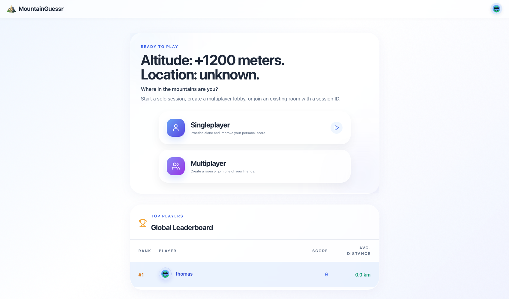
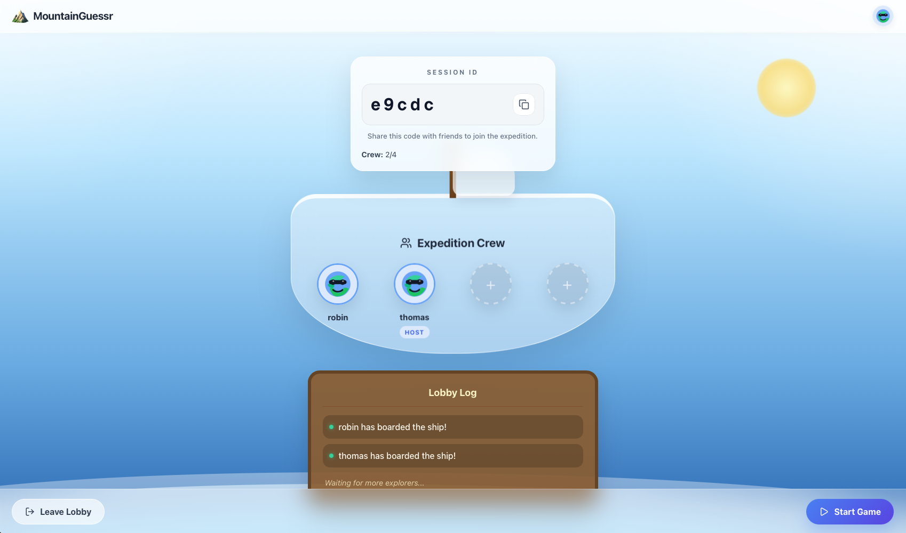
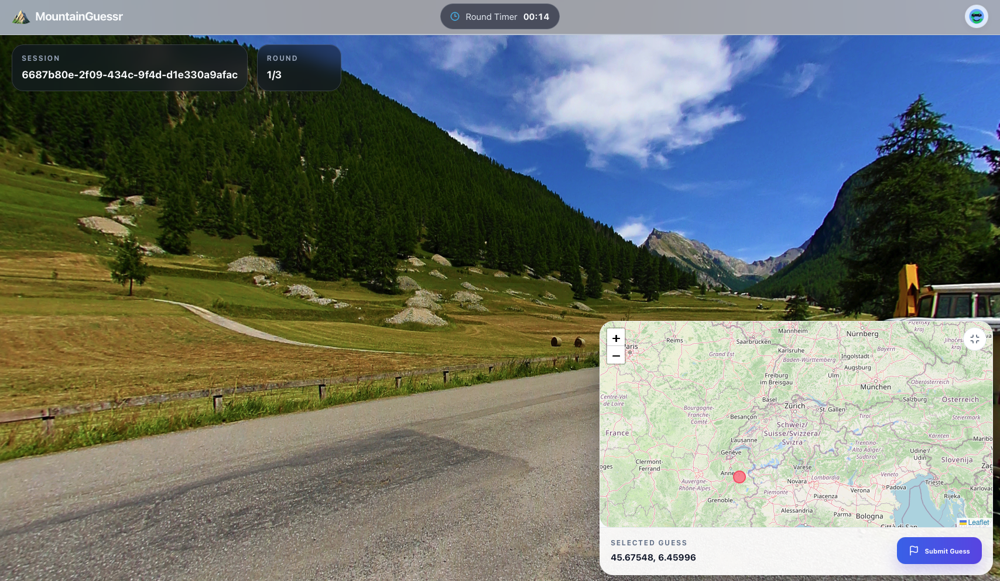
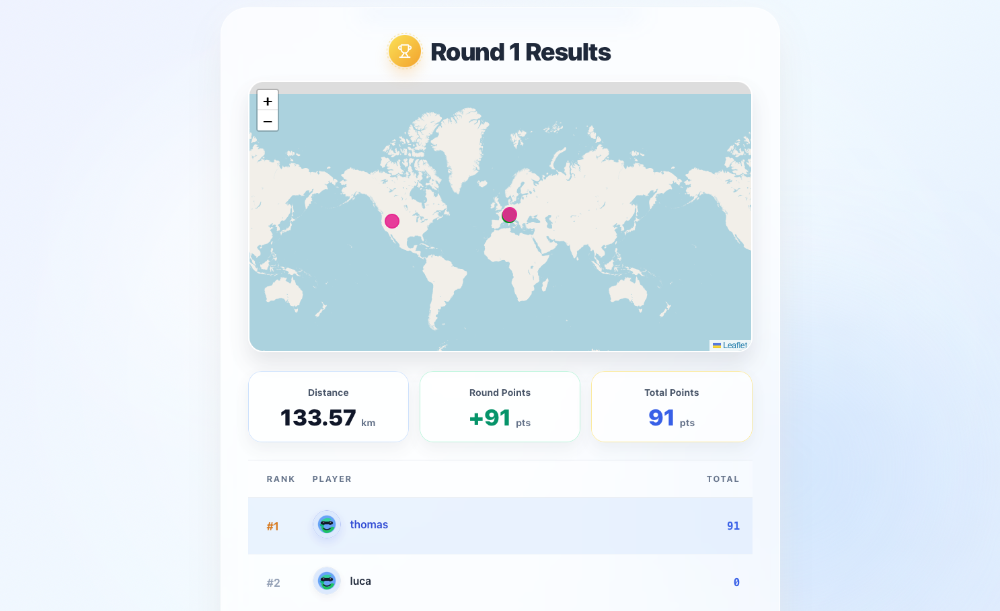

# MountainGuessr Client

[](https://sonarcloud.io/summary/new_code?id=bergwald_sopra-fs26-group-13-client)

## Introduction

MountainGuessr is a GeoGuessr-style web game built for the *Software Engineering Praktikum* course at UZH. Players explore a Google Street View panorama, place a guess on a world map, and receive a score based on the distance to the real location. The client provides the user interface for account management, session creation, multiplayer lobbies, timed guessing rounds, and round results.

The motivation is to make a fun multiplayer game about recognising mountains.

Deployed frontend: https://sopra-fs26-group-13-client.vercel.app  
Deployed backend: https://sopra-fs26-group-13-server.oa.r.appspot.com

## Technologies

- Next.js
- React and TypeScript
- Ant Design and lucide-react
- Leaflet and React Leaflet for maps
- Google Maps JavaScript API for Street View
- Vercel and Docker for deployment

## High-Level Components

- [Home and session entry](app/page.tsx): lets authenticated players start a single-player game, create a multiplayer session, join an existing session, choose a region, and view the leaderboard.
- [Authentication and profile pages](app/login/page.tsx): handle login, registration, profile display, and profile editing with local token storage from [auth utilities](app/utils/auth.ts).
- [Lobby](app/lobby/%5Bsession_id%5D/page.tsx): polls the backend for session members, shows the join code, lets the owner start the match, and routes all players into the game once the round begins.
- [Game round](app/game/%5Bsession_id%5D/page.tsx): combines [Street View](app/components/GameStreetView.tsx), the guessing map, countdown timing, and guess submission.
- [Result view](app/result/%5Bsession_id%5D/page.tsx): displays the guessed location, actual location, score, distance, and multiplayer standings before the next round.
- [API service](app/api/apiService.ts): centralizes HTTP calls to the backend and applies the runtime API base URL from [domain utilities](app/utils/domain.ts).

These components are connected through backend session IDs. The home page creates or joins a session, the lobby keeps session membership synchronized, the game page fetches the current round data and submits guesses, and the result page reads the resulting score and coordinates.

## Launch & Deployment

### Prerequisites

- Node.js 22.
- npm
- A running backend at `http://localhost:8080` for local development.
- A browser-restricted Google Maps JavaScript API key for Street View.

### Local Development

Install dependencies:

```bash
npm install
```

Create `.env.local` in the client project root:

```bash
NEXT_PUBLIC_GOOGLE_MAPS_BROWSER_API_KEY=your_browser_restricted_key_here
```

Start the development server:

```bash
npm run dev
```

The app runs at http://localhost:3000 and calls the local backend at http://localhost:8080. Restart the dev server after changing `.env.local`.

### Build and Run Production Locally

```bash
npm run build
npm run start
```

## Illustrations

Main user flow:

1. The user registers or logs in and starts a single-player session or creates/joins a multiplayer session from the homepage.
2. In multiplayer, the users wait in the lobby until the owner starts the game.
3. Each game consists of three rounds. In each round, the user views a Google Street View panorama of mountains, guesses a location on a map by placing a map, and submit the guess.
4. On the result page, the user can then review the distance, score, correct location, and leaderboard.









## Roadmap

- Add automated frontend tests for authentication, session creation, gameplay, and result flows.
- Improve multiplayer readiness and synchronization so players can see who is ready before the owner starts the game.
- Add more curated regions and location packs with richer region metadata.

## Authors and Acknowledgment

Authors:

- @bergwald (Thomas)
- @PAKaeser (Patricia)
- @juliand924 (Julian)
- @plaiimade (Robin)

This project was created for the UZH *Software Engineering Praktikum* course. We thank Yunyi Zhang and the SoPra team at UZH for their supervision, support, and guidance.

## License

This project is licensed under the Apache License 2.0. See [LICENSE](LICENSE) for details.
